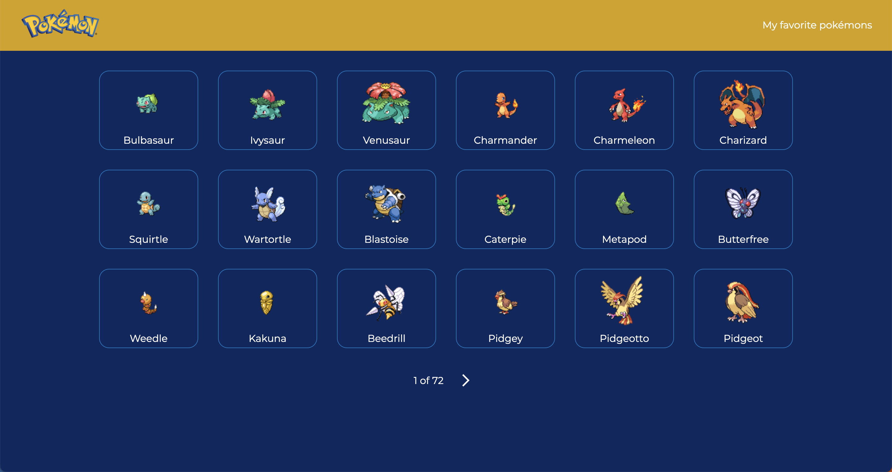

# <div align="center"> Pokedex React App</div>




<p align="center">This is a sample React application that connects to the PokeAPI using Vite as a build tool, TypeScript for type checking, Material UI for styling, and Styled Components for additional styling options.</p>

## 🛠️ Technologies

<ul>
  <li><a href="https://reactjs.org/">React</a></li>
  <li><a href="https://vitejs.dev/">Vite</a></li>
  <li><a href="https://www.typescriptlang.org/">TypeScript</a></li>
  <li><a href="https://mui.com/">Material UI</a></li>
  <li><a href="https://styled-components.com/
  ">Styled Components</a></li>
  <li><a href="https://pokeapi.co/">Poke Api</a></li>
</ul>

## ⚙️ Requirements

<ul>
  <li><a href="https://nodejs.org/en/">Node.js</a></li>
  <li><a href="https://www.npmjs.com/">NPM</a></li>
</ul>

## 🚀 Installation

To get started, clone this repository and install the necessary dependencies using npm or yarn:

```
# using npm
$ npm install

# using yarn
$ yarn
```

## ⚡️ Usage

To run the application locally, use the following command:

```
# using npm
npm run dev

# using yarn
yarn dev
```

This will start a local development server on https://localhost:5173. You can then view the application in your web browser.

## Running Tests

This project includes automated tests to verify the functionality of the code. To run the tests locally, follow these steps:

```
# using npm
npm run test

# using yarn
yarn test

```
